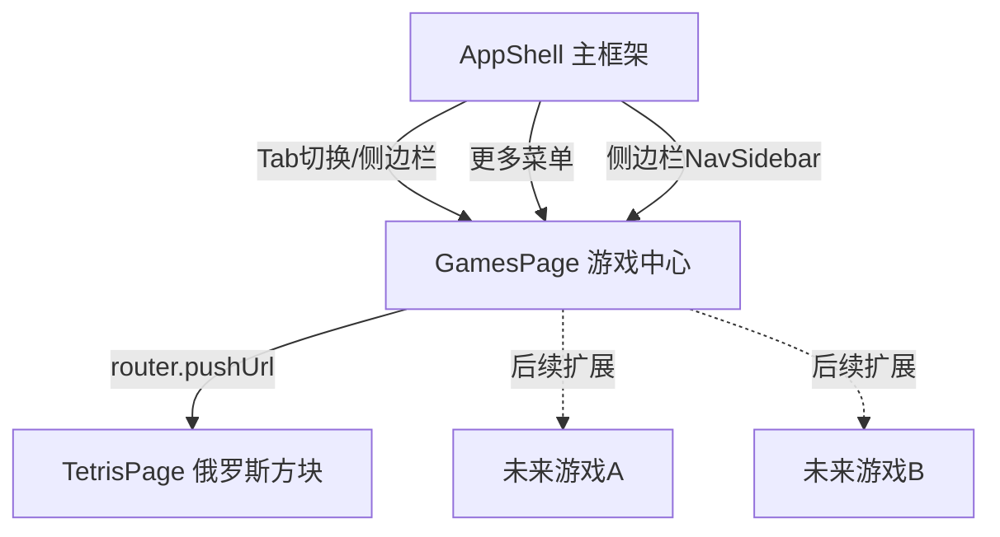

## 产品概述

在"智子"运维管理工具中集成俄罗斯方块游戏模块。采用可扩展的游戏中心架构设计，游戏中心作为统一入口页面，俄罗斯方块为首个入驻游戏，后续可轻松添加更多游戏。

## 核心功能

- **游戏中心页面**：以卡片列表形式展示所有可用游戏，每个卡片显示游戏名称、图标和简介，俄罗斯方块作为首款游戏展示
- **俄罗斯方块游戏**：10x20标准棋盘，7种经典方块（I/O/T/S/Z/J/L），使用AppTheme配色方案
- **双重控制方式**：支持触摸手势（左右滑动移动、上滑旋转、下滑加速下落、点击旋转）和按钮控制（方向键+旋转+加速下落）
- **完整游戏机制**：分数系统（单消100/双消300/三消500/四消800）、等级递增与速度提升、下一个方块预览、行消除动画、游戏结束判定与重新开始
- **响应式布局**：手机端采用棋盘上方+按钮下方的纵向布局，平板端采用棋盘左侧+信息面板右侧的横向布局
- **导航集成**：游戏中心入口放入手机端"更多"菜单和平板端侧边栏，俄罗斯方块通过router从游戏中心跳转进入

## 技术栈

- 开发语言：ArkTS（严格模式，禁用 any/unknown）
- UI 框架：ArkUI 声明式组件 + Stage 模型
- 目标 SDK：HarmonyOS 6.1.1 (API 24)
- 路由：`router.pushUrl()` 二级页面跳转
- 状态管理：`@State` + `@StorageLink` 响应式
- 主题：复用项目现有 AppTheme 暗色配色系统

## 实现方案

### 整体架构

采用两层导航架构：游戏中心（GamesPage）作为一级Tab页面直接渲染在 AppShell 中，俄罗斯方块（TetrisPage）作为二级页面通过 router 跳转。这种设计既保持了与现有页面一致的导航模式，又为后续游戏扩展提供了清晰的层级结构。



### 俄罗斯方块游戏核心设计

#### 数据结构

- **棋盘**：`number[][]` 二维数组，20行x10列，0表示空，1-7表示不同方块颜色索引
- **方块定义**：7种方块各4个旋转形态，存储为坐标偏移数组
- **游戏状态**：`board`、`currentPiece`、`currentX`、`currentY`、`currentRotation`、`nextPiece`、`score`、`level`、`lines`、`isGameOver`、`isPaused`
- **定时器**：`setInterval` 控制方块自动下落，等级越高间隔越短

#### 核心逻辑

- **碰撞检测**：检查方块在指定位置和旋转状态下是否与棋盘边界或其他已固定方块重叠
- **方块锁定**：当前方块无法继续下落时，将其坐标写入棋盘数组
- **行消除**：遍历所有行，找到完整行后移除，上方行下移，累计分数
- **游戏循环**：`aboutToAppear()` 启动定时器 → 每 tick 方块下落 → 碰撞检测 → 锁定/消除 → 生成新方块 → 检查游戏结束 → `aboutToDisappear()` 清除定时器

#### 手势处理

- 使用 ArkUI 的 `gesture` API：`PanGesture` 处理滑动（左右滑动移动、上滑旋转、下滑加速下落），`TapGesture` 处理点击旋转
- 手势与按钮控制共享同一套逻辑方法（`moveLeft()`、`moveRight()`、`rotate()`、`hardDrop()`），避免重复代码

#### 性能考虑

- 棋盘渲染使用 `ForEach` + 固定数量的 `Grid` 或 `Column/Row` 嵌套，避免动态创建大量组件
- 定时器间隔在 `aboutToDisappear()` 中清理，防止内存泄漏
- 方块坐标计算在 JS 层完成，仅将结果映射到 UI

### 实现细节

#### 文件变更清单

```
entry/src/main/
├── ets/
│   ├── common/
│   │   └── Constants.ets                          # [MODIFY] navItems 数组追加 Games 导航项
│   ├── pages/
│   │   ├── AppShell.ets                           # [MODIFY] 导入GamesPage，renderPage添加分支，更多菜单加入Games
│   │   ├── Games.ets                              # [NEW] 游戏中心页面，卡片列表展示可用游戏
│   │   └── Tetris.ets                             # [NEW] 俄罗斯方块游戏完整实现
└── resources/
    └── base/
        └── profile/
            └── main_pages.json                    # [MODIFY] 注册 pages/Tetris 路由
```

#### Constants.ets 修改要点

- 在 `navItems` 数组末尾追加 `{ key: 'Games', label: '游戏中心', icon: '🎮' }`
- 索引变为10（从0开始），AppShell 中 `smMoreTabs` 需对应更新索引

#### AppShell.ets 修改要点

- 添加 `import { GamesPage } from './Games';`
- 在 `renderPage()` 中添加 `} else if (this.currentPage === 'Games') { GamesPage() }`
- `smMoreTabs` 数组追加 `this.allNavItems[9]`（Games 导航项）
- 保持现有 Tab 索引不变

#### 响应式布局策略

- **手机端（isSm = true）**：棋盘上方占主要区域，控制按钮和信息面板在下方
- **平板端（isSm = false）**：棋盘在左侧，右侧放置信息面板（分数/等级/预览）+ 控制按钮

#### 代码风格约束

- 严格遵循 ArkTS 严格模式：所有变量显式类型标注，不使用 any/unknown
- 颜色全部引用 `AppTheme` 静态常量
- 方块配色方案：I=primary, O=warning, T=purple, S=success, Z=danger, J=info, L=#F97316
- 使用 `TopBar` 作为页面头部，包含返回按钮和标题
- `aboutToAppear()` 中初始化游戏状态，`aboutToDisappear()` 中清除定时器
- 遵循现有 `.layoutWeight(1).height('100%').backgroundColor(AppTheme.bgBase)` 根容器模式